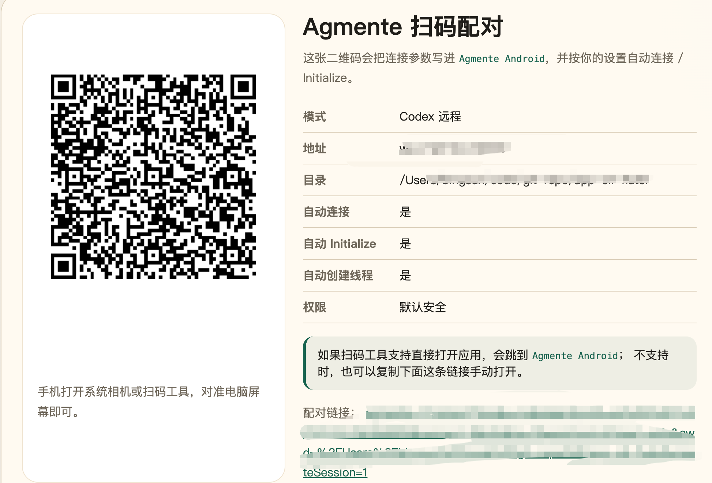
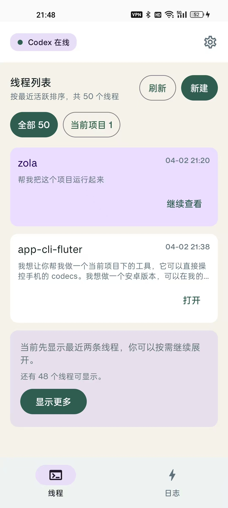
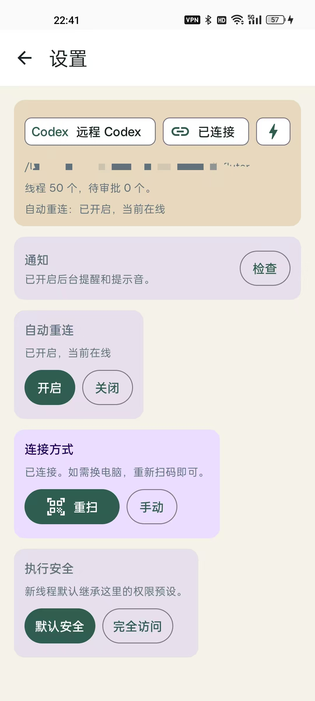

# OpenConnect Android

[中文说明](README.zh-CN.md)

OpenConnect is a native Android controller for `codex app-server`.
The intended setup is simple: your phone is the controller, and your computer does the actual work.

## Features

- Scan an `openconnect://connect?...` pairing QR code and connect to your own `codex app-server`
- Initialize, create threads, resume threads, and send prompts from the phone
- Review transcript output, tool calls, file changes, and approval requests in real time
- Switch the in-app language between English, Simplified Chinese, and Follow System
- Pass auth headers such as `Bearer Token` and Cloudflare Access service-token headers
- Package a release-ready APK bundle with bilingual quickstart documents

## Quick Start

Recommended network path:

`Android App -> WSS -> Cloudflare Tunnel / Access -> Your computer running codex app-server`

Run the environment check first:

```bash
bash scripts/openconnect_pair_up.sh doctor
```

Start the default Quick Tunnel flow:

```bash
bash scripts/openconnect_pair_up.sh up \
  --quick-tunnel \
  --cwd "/path/to/your/project"
```

If you use your own fixed domain, check the named tunnel setup first:

```bash
bash scripts/openconnect_pair_up.sh doctor \
  --named-tunnel openconnect-codex \
  --hostname codex.example.com
```

Then start it:

```bash
bash scripts/openconnect_pair_up.sh up \
  --named-tunnel openconnect-codex \
  --hostname codex.example.com \
  --cwd "/path/to/your/project"
```

If you already have a public WebSocket endpoint, you can skip Cloudflare startup and generate the pairing link directly:

```bash
bash scripts/openconnect_pair_up.sh up \
  --endpoint "wss://codex.example.com" \
  --cwd "/path/to/your/project"
```

Useful follow-up commands:

```bash
bash scripts/openconnect_pair_up.sh status
bash scripts/openconnect_pair_up.sh stop
```

## Screenshots

Pairing by QR code:



Thread list:



Settings and connection state:



Cover / showcase image:


## Release Bundle

Build a distributable APK bundle:

```bash
bash scripts/openconnect_release_bundle.sh
```

Build and install it to the currently connected Android phone:

```bash
bash scripts/openconnect_release_bundle.sh --install
```

The bundle is written to `dist/` and includes:

- APK
- `SHA256SUMS.txt`
- `QUICKSTART.md`
- `QUICKSTART.zh-CN.md`
- `RELEASE_NOTES.md` when the matching version notes exist

## Development

Build the debug APK from the repository root:

```bash
./gradlew :app:assembleDebug
```

Install it with `adb`:

```bash
adb install -r app/build/outputs/apk/debug/app-debug.apk
```

If Android SDK detection is missing, set it in `local.properties`:

```properties
sdk.dir=/path/to/Android/sdk
```

## Security Notes

- The open-source build does not embed the maintainer's private domain or tunnel.
- Each user should provide their own Quick Tunnel, named tunnel, or fixed `wss://` endpoint.
- Treat pairing QR codes as sensitive if they include bearer tokens or Cloudflare Access credentials.

## Documentation

- [English quickstart](docs/android-release-and-cloudflare.md)
- [中文快速上手](docs/android-release-and-cloudflare-zh.md)
- [Release notes v0.2.1](docs/release-notes-v0.2.1.md)
